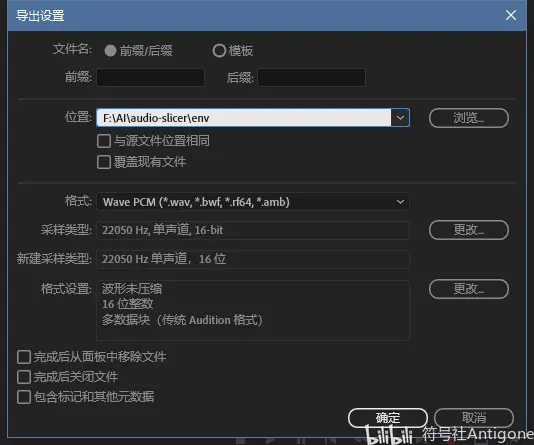

# How to use
(Suggestion) Python == 3.10.6
## Clone this repository
```sh
git clone https://github.com/CjangCjengh/vits.git
```
## Choose cleaners
- Fill "text_cleaners" in config.json
- Edit text/symbols.py
- Remove unnecessary imports from text/cleaners.py
## Install requirements
```sh
pip install -r requirements.txt
```
## Create datasets
### Single speaker
"n_speakers" should be 0 in config.json
```
path/to/XXX.wav|transcript
```
- Example
```
dataset/001.wav|こんにちは。
```
### Mutiple speakers
Speaker id should start from 0 
```
path/to/XXX.wav|speaker id|transcript
```
- Example
```
dataset/001.wav|0|こんにちは。
```
## Preprocess
If you have done this, set "cleaned_text" to true in config.json
```sh
# Single speaker
python preprocess.py --text_index 1 --filelists path/to/filelist_train.txt path/to/filelist_val.txt

# Mutiple speakers
python preprocess.py --text_index 2 --filelists path/to/filelist_train.txt path/to/filelist_val.txt
```
## Build monotonic alignment search
```sh
cd monotonic_align
python setup.py build_ext --inplace
cd ..
```
## Train
```sh
# Single speaker
python train.py -c <config> -m <folder>

# Mutiple speakers
python train_ms.py -c <config> -m <folder>
```
## Inference
### Online
See [inference.ipynb](inference.ipynb)
### Offline
See [MoeGoe](https://github.com/CjangCjengh/MoeGoe)

# Running in Docker

```sh
docker run -itd --gpus all --name "Container name" -e NVIDIA_DRIVER_CAPABILITIES=compute,utility -e NVIDIA_VISIBLE_DEVICES=all "Image name"
```
```
conda cd到monotonic_align文件夹，输入以下命令

python setup.py build_ext --inplace 作者：符号社Antigone https://www.bilibili.com/read/cv21153903/ 出处：bilibili
预处理
python preprocess.py --text_index 1 --filelists filelists/train.txt  filelists/val.txt 
训练
python .\train.py -c F:\lujiale\vits\config.json -m ModelVit
```


因为搜遍全网也找不到几个详细点的本地训练教程，更不用说各大佬GitHub里无比精简的README了，所以分享研究几天的经验供大家参考，能力有限，欢迎指正补充。本教程仅包含Cj版VITS，在本地使用CUDA训练单人中文模型及Windows下的TTS推理，Colab在线中文模型训练教程视需求更新。

个人建议有能力及条件的朋友使用Linux训练，不仅报错会减少，而且会更高效地利用显卡性能来训练。

网络问题：

从GitHub到安装各类插件、软件，建议全程使用代理，或者自行搜索相关镜像源及换源（GitHub、Conda、pip等），本文均按照网络环境已经通畅来进行。

硬件要求：

内存最好在16G以上。

显存最好在12G以上，最低也得6G，而且必须是支持CUDA的N卡。A卡目前理论上也有办法跑torch，但是非常复杂且麻烦，其不在本文讨论范围内。

相关链接：

VITS原版：https://github.com/jaywalnut310/vits

VITS（CjangCjengh版）：https://github.com/CjangCjengh/vits

audio-slicer：https://github.com/openvpi/audio-slicer

零基础炼丹秘籍 - 为自己喜爱的角色训练TTS（文字转语音）模型 ：https://www.bilibili.com/read/cv17826415

零基础炼丹 - vits版补充 ：https://www.bilibili.com/read/cv18357171

vits注解（不完全正确） ：https://www.bilibili.com/read/cv18478187

初探VITS AI语音模型训练 – Fantasy Land（需加速访问）：https://east.moe/archives/1342

【AI术语】看不懂炼丹黑话？相关词条整理（什么是炸炉？过拟合？学习率？：https://www.bilibili.com/read/cv20351511


数据集准备（以单人数据集为例）
删除filelists中的所有文件（无用）。然后，在里面新建list.txt和list_val.txt文件（文件名可自定义，后面记得改），文件编码务必是UTF-8（不带BOM）！

删除
然后再如上图在项目文件夹中添加wavs文件夹，上图为已添加后的截图。

数据集的整理具体可参考相关链接中的《零基础炼丹 - vits版补充 》专栏。


接下来是音频处理

首先建议阅读相关链接中的《vits注解（不完全正确）》了解什么是训练集、验证集。

如果有比较充足的兴趣和时间还可以阅读学习相关链接中的：【AI术语】看不懂炼丹黑话？相关词条整理（什么是炸炉？过拟合？学习率？（https://www.bilibili.com/read/cv20351511）


接下来使用Au对你要训练的长音频文件（类似软件都可以，这里以Au为例）进行重新编码。

音频要求：无背景音（自行搜索如何去背景音、去噪、去BGM）、吐字清晰、无明显情感波动、语速适中、音量大小均衡。如果不符合要求将会影响训练出的模型质量。


进入批处理面板，将音频文件放进去，打开导出设置


位置任意，格式请严格按照上图选择（单声道、22050Hz，PCM 16bit），剩下设置按需操作。

设置完导出设置点击确定，然后在面板中点击运行即可。


接下来进行音频的分割处理（以audio-slicer为例）

根据前文提到过的办法，下载audio-slicer项目（https://github.com/openvpi/audio-slicer），进入项目文件夹。

打开conda终端（Anaconda Powershell Prompt）

创建slicer虚拟环境，命令如下：

conda create -n slicer python=3.7

之后一路确定，安装完激活环境，命令如下：

conda activate slicer

然后cd到audio-slicer项目文件夹，根据requirements.txt安装相关依赖（pip或者conda都可以，如果出现依赖冲突等问题，可以自行选择版本命令安装或者按需修改requirements.txt）：

pip install -r requirements.txt

安装完依赖，将Au处理过的音频移动到当前目录（建议重新命名为1.wav、2.wav……）进行音频分割（如果有自定义需求，如音频长度等等可参考项目README）：

python slicer.py 这里填你命名的文件

稍等片刻，分割完毕。

然后将分割后的文件（不包含原文件）移动至前面的wavs目录。


接下来进行文本整理

打开filelists目录中的list.txt（训练集）和list_val.txt（验证集）文件。

数据整理可参考前文提到的“零基础炼丹”相关文章。

关于标点符号，如下图，请参考项目文件夹下text文件夹中的symbols.py中的chinese_cleaner段落中的punctuation行，如果你知道cleaner的工作机制，也可以修改、自制、选择其他作者的cleaner，本文均使用Cj版的中文cleaner。


关于数据量，个人建议训练集五百条十秒长的语音起步，越多更好；验证集大概为训练集十分之一左右。

如图所示

重要：两个txt文件都必须不带任何空行，末尾处也不可以，否则后面预处理会报“out of range”的错。

文字前的路径可以参考下面简单写的Python脚本来处理。

i=0

f = open('output.txt','a',encoding="utf-8")


while i < 100:

    f.write('wavs/1_')

    f.write(str(i))

    f.write('.wav|\n')

    i=int(i)

    i=i+1


else:

    f.close()

    print('写入已完成')

至此，数据集制作完毕。


搭建VITS环境
新建conda虚拟环境：

conda create -n vits python=3.7

激活环境：

conda activate vits

接下来先安装torch（重要）

先确定显卡驱动，输入以下命令：

nvidia-smi


查看CUDA驱动是否正常以及CUDA版本。（CUDA驱动如果没有自行搜索下载安装）

torch一定要安装带有CUDA版本的且CUDA版本应低于你驱动的CUDA版本，其安装方法主要有三种：Conda在线安装、pip在线或本地安装。

Conda或是pip在线安装（pip如果换源安装torch容易报错）


在线安装可参考上图Pytorch官网（https://pytorch.org/）给出的命令（conda和pip）


本地安装，打开(https://download.pytorch.org/whl/torch_stable.html)下载pytorch和torchvision的whl安装包

个人建议选择比较新的稳定版本，而非requirements.txt中的上古版本。

其中torch后缀解释示例：cu102-cp37-win为Windows下Python3.7（如果你按照前文命令搭建环境，则选择3.7版本即可）版本带且有102版本CUDA的安装包，一定要选择带有cu的！

之后在conda命令行cd到下载目录（cd 你的下载路径）输入以下命令：

pip install 你下载的安装包名字（带whl后缀）

等待安装完毕即可。


安装相关依赖

cd切回刚才的vits目录，先不要急着安装requirements.txt，打开该文件删除torch相关的两行

如图
然后清理不需要的依赖，如果需要训练中文模型，像pyopenjtalk（装起来还费劲）、num_thai这些都可以删掉（可选），不过需要处理相关的py文件以免报错（后面会涉及），还可以删掉==后的所有版本内容（可选，已测试可行），因为这个文件列的依赖其实挺乱的，如果严格按照其版本安装可能报错。

接下来用pip安装requirements.txt（或者自己手动敲命令安装，方便处理报错）：

pip install -r requirements.txt

另外，如果你没有删掉pyopenjtalk一行，安装这个模块大概率报错，解决方法可参考：https://www.bilibili.com/video/BV13t4y1V7DV/

依赖全部安装完可以输入pip list查看所有的包，方便对照requirements。


安装MSVC（仅Windows）

打开https://visualstudio.microsoft.com/zh-hans/downloads/

下载安装visual studio installer

在installer中选择单个组件，搜索MSVC安装适合版本的生成工具（并非安装Visual Studio）。安装路径可以不用是C盘。

如图
Build monotonic alignment search
此步很重要，如果跳过运行训练必报错。

conda cd到monotonic_align文件夹，输入以下命令

python setup.py build_ext --inplace

正常情况下不会报错，如果报错检查生成工具或者是其环境变量的搭建。

如果出现“可能丢失数据”字样，并且该文件夹没有再嵌套一个monotonic_align文件夹，但是多出来了build文件夹，将build文件夹中的lib开头的文件夹中的monotonic_align文件夹移动到最外层的monotonic_align文件夹即可。

注意：Windows下build后的core不与Linux通用，如果更换平台需要重新build。

至此，环境的搭建完成。

修改项目文件（以训练中文模型为例）
config.json

首先根据configs文件夹中给出的例子生成一份属于自己的config.json放在此目录，在这里我们选择给出的chinese_base.json为例。

train部分：


eval_interval为保存间隔，这里按照默认的1000即可以满足保存的需求，设置过小会训练过程会耗费大量时间在保存上；设置过大如果训练出现问题无法满足及时保存最近的模型的需求。

epochs迭代次数，一般来说比较好的数据集质量不到一千就能出现效果，两千往上勉强可以使用，这里个人建议一万到两万效果最佳。

batch_size一定要改！请按照你的显存酌情修改（否则开始训练就爆显存），6G大概为4左右，12G可以到16左右，以此类推。建议后面尝试自行开跑训练，测试并设置合适自己的数值。

fp16_run半精度训练，一般按照默认开启即可，如果你对你的配置过于自信可以尝试关闭。

剩下的不用改动。

data部分：


前两行要改成我们前面保存list.txt和list_val.txt路径，即filelists/list.txt.cleaned和filelists/list_val.txt.cleaned

text_cleaners因为我们是中文模型，保持默认即可。

关于cleaned的后缀，加上就完了，后面我们预处理就会clean了。

n_speakers说话人数，因为我们是单人改为0即可。

cleaned_text保持默认的true即可，原因参考上上条。


如果是单人，speaker这行可以删掉，也可以随便填一个自定义的名字，无影响。

如果你不了解cleaner的工作机制，请不要动symbols，这里的Unicode是与前文的symbols.py保持一致的。

修改Cleaner

因为下载下来的项目代码默认cleaner并非是中文cleaner，所以我们需要处理一下py代码。

打开text文件夹下的symbols.py，注释掉japanese_cleaners2，去掉chinese_cleaners的注释。


修改后如下图所示：


接下来打开cleaners.py，注释掉与中文cleaner无关import


修改后如图下所示：


这样如果前面如果没有安装与中文无关的python依赖就不会报错了。

预处理
回到项目目录，打开preprocess.py


将第十行的english_cleaners2改为chinese_cleaners，这样预处理默认就是中文cleaner了。

打开conda终端，cd到项目目录，输入以下命令预处理txt文件（提示：路径以Windows为例，Linux斜杠用/）：

python preprocess.py --text_index 1 --filelists 存放list.txt的目录\list.txt 存放list_val.txt的目录\list_val.txt

跑完预处理，就可以准备开始训练了。

修改train.py（仅Windows）

原train.py代码并不适合Windows跑（Linux请跳过此步），开跑会直接报nccl错，所以我们需要修改。

打开train.py


将67行的nccl改为gloo

开始训练（以单人模型为例）
打开conda终端，在项目目录中输入以下命令开始训练（仍以Windows下路径为例）：

python train.py -c 你存放config.json的目录\config.json -m 你的自定义模型名

（最常见，自行摸索出的办法）如报错“RuntimeError: Expected to have finished reduction in the prior iteration before starting a new one. This error indicates that your module has parameters that were not used in producing loss.”，打开train.py，如下图所示将104和105行模型的参数后加上find_unused_parameters=True

注：但是find_unused_parameters=True的设置会带来额外的运行时开销（而且还不小）。

动手能力强的朋友可以自行参考类似文章（https://zhuanlan.zhihu.com/p/592515484）对代码进行深一些的修改。


改后的代码如上图所示。

如果报错Broken pipe，请尝试重启电脑重试。

Linux下训练
Win下训练
如上图所示，如果正常saving保存pth文件以及Epoch迭代，那么就是在进行正常训练。Epoch后面的数字为迭代数。pth模型文件保存在项目文件夹上一级目录drive中的MyDrive文件夹中。自动保存会仅保留当前最新两次进度，所以不用担心占用过大空间。

TTS推理（仅Windows）
可以使用VITS模型的TTS软件有不少（MoeTTS、MoeGoe等等），这里以Cj大佬的MoeGoe为例。

前往（https://github.com/CjangCjengh/MoeGoe/releases）下载最新版的MoeGoe命令行版本（MoeGoe.7z），将其解压到任意目录。

接着前往（https://github.com/CjangCjengh/MoeGoe_GUI/releases）下载最新版相对应的GUI启动器（MoeGoe_GUI.exe），建议将启动器放到MoeGoe同目录。

然后打开MoeGoe_GUI.exe


如上图所示，打开文件选择MoeGoe解压目录中的MoeGoe.exe，打开模型选择前文中的pth模型文件（仅需要打开开头为G的）。打开配置选择模型同目录的config.json即可。

然后再语音合成中输入要合成音频的文本，参数设置可调节语速，选择说话人，选择保存路径就会自动开始TTS推理了。

有关MoeGoe其他功能可自行查看官方文档以及作者视频（https://space.bilibili.com/35285881）自行摸索。
